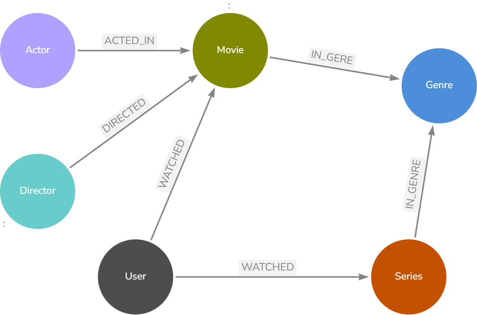

# 🎬 Neo4j – Sistema de Recomendação para Serviço de Streaming

### *Projeto do Bootcamp Neo4j by DIO*

Este repositório apresenta o modelo de grafo desenvolvido para um **serviço de streaming de filmes e séries**, utilizando **Neo4j**.
O objetivo é demonstrar como relacionamentos bem estruturados podem gerar um **sistema de recomendação poderoso**, explorando todo o potencial dos grafos.

---

## 🖼️ Diagrama Visual do Grafo

Abaixo está o diagrama visual presente na raiz do repositório:

---

## 🚀 Objetivos do Projeto

* Criar um banco de dados orientado a grafos no Neo4j.
* Modelar entidades essenciais ao ecossistema de streaming.
* Representar conexões que permitam recomendações baseadas em:

  * obras assistidas
  * gêneros favoritos
  * atores e diretores preferidos
  * avaliações (ratings)
* Popular o grafo com um conjunto inicial de dados para exploração.

---

## 🧩 Modelo Conceitual

### **Nós (Entidades)**

* **User**
* **Movie**
* **Series**
* **Genre**
* **Actor**
* **Director**

### **Relacionamentos**

* `WATCHED` — *User → Movie/Series* (com propriedade `rating`)
* `ACTED_IN` — *Actor → Movie/Series*
* `DIRECTED` — *Director → Movie/Series*
* `IN_GENRE` — *Movie/Series → Genre*

---

## 📝 Script Cypher

O script completo está disponível no repositório:

📄 **`script.cypher`**

> Ele cria *constraints*, popula os nós e estabelece todos os relacionamentos.

---

## ▶️ Como Executar

1. Instale o Neo4j Desktop ou utilize Neo4j AuraDB.
2. Crie um novo banco de dados.
3. Abra o Neo4j Browser.
4. Execute o conteúdo do arquivo **`script.cypher`**.
5. Explore o grafo à vontade.

---

## 📚 Extensões Possíveis

* Recomendação baseada em similaridade entre usuários
* Análises de centralidade
* Queries avançadas de recomendação
* Visualização interativa usando Neo4j Bloom

